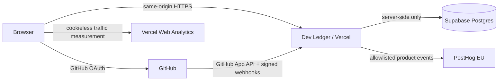

<div align="center">

<h1>DEV LEDGER</h1>

<p><strong>Your GitHub history, made legible.</strong></p>

<p>Open source · Privacy-conscious · Read-only</p>

<p>
  <a href="https://devledger.site"><strong>Live App</strong></a>
  ·
  <a href="docs/architecture.md"><strong>Documentation</strong></a>
  ·
  <a href="https://devledger.site/security"><strong>Security</strong></a>
  ·
  <a href="LICENSE"><strong>License</strong></a>
</p>

<p><code>v1.3.0</code> · <code>AGPL-3.0-only</code></p>

</div>

<p align="center">
  
</p>

---

## What Dev Ledger measures

Dev Ledger connects through a GitHub App and builds a read-only analytical record from repositories the user explicitly authorizes.

| **MEASURE** | **ACTIVITY** | **CODE** |
| --- | --- | --- |
| Net source growth | Active days | Language composition |
| Additions & deletions | Streaks & extremes | Repository history |
| Churn | Circadian patterns | Project evolution |
| Commits | Rhythm & milestones | Longitudinal change |

| **SHARE** | **HISTORY** | **SYNC** |
| --- | --- | --- |
| Range-aware visual records | Months and years of development | GitHub webhooks |
| Compact exports | Change over time | Resumable history coverage |
| Selected-range context | Longitudinal patterns | Rate-limit-aware continuation |

## Privacy by design

> [!IMPORTANT]
> **Dev Ledger measures development activity without indexing repository source code.**

Dev Ledger is intentionally narrower than a source-code indexing product.

| Dev Ledger uses | Dev Ledger does **not persist** |
| --- | --- |
| Repository metadata needed for product metrics | Repository source code |
| Git-derived activity data | Commit messages |
| Language statistics | Pull-request titles |
| Computed development history | GitHub email addresses |
| Synchronization state | GitHub OAuth access tokens |
|  | GitHub App installation tokens |
|  | Raw webhook payload bodies |

The product stores only the GitHub-derived metadata needed to compute its metrics and maintain synchronization. Repository permissions are read-only.

The public [Security & Privacy Trust Record](https://devledger.site/security) documents the current implementation and security boundaries in detail.

## Architecture



The frontend is React + Vite. API routes run as Vercel Functions. GitHub App ingestion writes normalized metadata to Supabase Postgres. The browser never receives a database service credential.

[Read the architecture documentation →](docs/architecture.md)

## Technology

| | |
| --- | --- |
| **Frontend** | React 19 · TypeScript · Vite 8 |
| **Interface** | Tailwind CSS 4 · Framer Motion |
| **Identity** | GitHub OAuth · GitHub App |
| **Compute** | Vercel Functions |
| **Data** | Supabase Postgres |
| **Product analytics** | PostHog · custom-event-only |
| **Traffic analytics** | Vercel Web Analytics |
| **CI** | GitHub Actions |
| **Security checks** | Typecheck · tests · npm audit · gitleaks · artifact scan · recovery drill |

## Quick start

**Requirements:** Node.js 24 · npm · Git

```bash
git clone https://github.com/Aliferous3/dev-ledger.git
cd dev-ledger
npm ci
npm run dev
```

Plain Vite runs the UI with synthetic development fixtures. Production builds replace the fixture barrel with an inert stub, so fixture telemetry does not ship to users.

<details>
<summary><strong>Run the full GitHub + Supabase stack</strong></summary>

<br>

Install the Vercel CLI, copy the environment template, and populate your own GitHub App and Supabase values:

```bash
cp .env.example .env.local
vercel dev
```

Never commit `.env.local`, private keys, database dumps, or provider credentials.

</details>

<details>
<summary><strong>Run the verification suite</strong></summary>

<br>

Run the same core checks used by CI:

```bash
npm run build
npm run typecheck
npm test
npm audit --audit-level=moderate
```

The GitHub Actions security gate also scans git history with gitleaks and runs a synthetic Postgres 17 migrate → backup → restore verification.

</details>

<details>
<summary><strong>Database operations</strong></summary>

<br>

Migrations live in [`migrations/`](migrations/) and are the schema source of truth.

Postgres 17 or Docker is required only for local recovery-drill work.

```bash
npm run db:migrate
npm run db:backup
npm run db:drill
```

The recovery drill refuses non-local database targets. Production recovery remains an operator-controlled procedure documented in [docs/disaster-recovery.md](docs/disaster-recovery.md).

</details>

## Security

> [!CAUTION]
> **Do not open a public issue for a vulnerability.** Follow [SECURITY.md](SECURITY.md) for private reporting.

The repository CI is intentionally fail-closed around common release risks: dependency audit, secret scanning, browser/server environment separation, built-artifact inspection, strict typechecking, and a synthetic recovery drill.

## Repository guides

| **CONTRIBUTE** | **SECURITY** | **OPERATIONS** | **PROJECT** |
| --- | --- | --- | --- |
| [Contributing](CONTRIBUTING.md) | [Security policy](SECURITY.md) | [Architecture](docs/architecture.md) | [Changelog](CHANGELOG.md) |
| [Code of conduct](CODE_OF_CONDUCT.md) | [Support](SUPPORT.md) | [Disaster recovery](docs/disaster-recovery.md) | [Trademark policy](TRADEMARKS.md) |
| [Contributor agreement](CONTRIBUTOR_LICENSE_AGREEMENT.md) | [Security & Privacy](https://devledger.site/security) | [Secret rotation](docs/secret-rotation.md) | [Privacy Policy](https://devledger.site/privacy) |

## Status

Current application version: **v1.3.0**

Dev Ledger is under active development. Metrics are derived from available GitHub history and can be affected by repository deletion, force-pushes, attribution gaps, API limits, and disconnected repositories.

## License

Dev Ledger is open source under the **GNU Affero General Public License v3.0 only (AGPL-3.0-only)**. See [LICENSE](LICENSE).

The AGPL permits use, modification, redistribution, and commercial use subject to its terms, including source-availability obligations for qualifying modified network deployments. The Dev Ledger name, logo, and distinctive branding are addressed separately in [TRADEMARKS.md](TRADEMARKS.md).

Contributions are welcome under [CONTRIBUTING.md](CONTRIBUTING.md) and the [Contributor License Agreement](CONTRIBUTOR_LICENSE_AGREEMENT.md).

---

<div align="center">

**Dev Ledger** · Your GitHub history, made legible.

[Live App](https://devledger.site) · [Privacy Policy](https://devledger.site/privacy) · [Terms of Service](https://devledger.site/terms)

</div>
