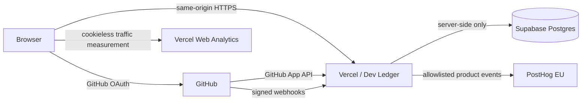

# Dev Ledger

**Your GitHub history, made legible.**

Dev Ledger is an open-source, privacy-conscious, read-only developer analytics application that turns GitHub history into a longitudinal record of work: commits, source growth, activity patterns, languages, projects, and change over time.

[Live app](https://devledger.site) · [Source license](LICENSE) · [Privacy Policy](https://devledger.site/privacy) · [Terms of Service](https://devledger.site/terms) · [Security & Privacy](https://devledger.site/security)

<p align="center">
  
</p>

## What it does

Dev Ledger connects through a GitHub App and builds a read-only analytical record from repositories the user explicitly authorizes.

- **Measure** — net source growth, additions, deletions, churn, and commits across selectable date ranges.
- **Activity** — active days, streaks, extremes, circadian patterns, rhythm, and milestones.
- **Code** — language composition, source growth, churn, and repository-level project history.
- **Longitudinal view** — observe how work changes across months and years rather than treating Git history as a flat event list.
- **Share records** — export a compact visual record for the currently selected range.
- **Incremental sync** — GitHub webhooks, scheduled continuation, resumable history coverage, and rate-limit-aware synchronization.

## Privacy by design

Dev Ledger is intentionally narrower than a source-code indexing product.

It **does not persist**:

- repository source code;
- commit messages;
- pull-request titles;
- GitHub email addresses;
- GitHub OAuth access tokens;
- GitHub App installation tokens; or
- raw webhook payload bodies.

The product stores only the GitHub-derived metadata needed to compute its metrics and maintain synchronization. Repository permissions are read-only.

The public [Security & Privacy Trust Record](https://devledger.site/security) documents the current implementation and security boundaries in detail.

## Architecture



The frontend is React + Vite. API routes run as Vercel Functions. GitHub App ingestion writes normalized metadata to Supabase Postgres. The browser never receives a database service credential.

More detail: [docs/architecture.md](docs/architecture.md).

## Stack

| Layer | Technology |
| --- | --- |
| Frontend | React 19, TypeScript, Vite 8 |
| Styling | Tailwind CSS 4 |
| Motion | Framer Motion |
| Authentication | GitHub OAuth + GitHub App |
| API | Vercel Functions |
| Database | Supabase Postgres |
| Product analytics | PostHog, custom-event-only |
| Traffic analytics | Vercel Web Analytics |
| CI | GitHub Actions |
| Security checks | Typecheck, tests, npm audit, gitleaks, artifact scan, recovery drill |

## Local development

### Requirements

- Node.js **24**
- npm
- Git
- Vercel CLI only when exercising the real API routes
- Postgres 17 or Docker only for local recovery-drill work

### Install

```bash
git clone https://github.com/Aliferous3/dev-ledger.git
cd dev-ledger
npm ci
```

### Fixture/design mode

```bash
npm run dev
```

Plain Vite runs the UI with synthetic development fixtures. Production builds replace the fixture barrel with an inert stub, so fixture telemetry does not ship to users.

### Full local stack

Copy the environment template and populate your own GitHub App and Supabase values:

```bash
cp .env.example .env.local
vercel dev
```

Never commit `.env.local`, private keys, database dumps, or provider credentials.

## Verification

Run the same core checks used by CI:

```bash
npm run build
npm run typecheck
npm test
npm audit --audit-level=moderate
```

The GitHub Actions security gate also scans git history with gitleaks and runs a synthetic Postgres 17 migrate → backup → restore verification.

## Database operations

Migrations live in [`migrations/`](migrations/) and are the schema source of truth.

```bash
npm run db:migrate
npm run db:backup
npm run db:drill
```

The recovery drill refuses non-local database targets. Production recovery remains an operator-controlled procedure documented in [docs/disaster-recovery.md](docs/disaster-recovery.md).

## Repository guides

- [Contributing](CONTRIBUTING.md)
- [Security policy](SECURITY.md)
- [Support](SUPPORT.md)
- [Code of conduct](CODE_OF_CONDUCT.md)
- [Architecture](docs/architecture.md)
- [Disaster recovery](docs/disaster-recovery.md)
- [Secret rotation](docs/secret-rotation.md)
- [Changelog](CHANGELOG.md)

## Security

Please **do not open a public issue for a vulnerability**. Follow [SECURITY.md](SECURITY.md) for private reporting.

The repository CI is intentionally fail-closed around common release risks: dependency audit, secret scanning, browser/server environment separation, built-artifact inspection, strict typechecking, and a synthetic recovery drill.

## Status

Current application version: **v1.3.0**

Dev Ledger is under active development. Metrics are derived from available GitHub history and can be affected by repository deletion, force-pushes, attribution gaps, API limits, and disconnected repositories.


## License

Dev Ledger is open source under the **GNU Affero General Public License v3.0 only (AGPL-3.0-only)**. See [LICENSE](LICENSE).

The AGPL permits use, modification, redistribution, and commercial use subject to its terms, including source-availability obligations for qualifying modified network deployments. The Dev Ledger name, logo, and distinctive branding are addressed separately in [TRADEMARKS.md](TRADEMARKS.md).

Contributions are welcome under [CONTRIBUTING.md](CONTRIBUTING.md) and the [Contributor License Agreement](CONTRIBUTOR_LICENSE_AGREEMENT.md).
