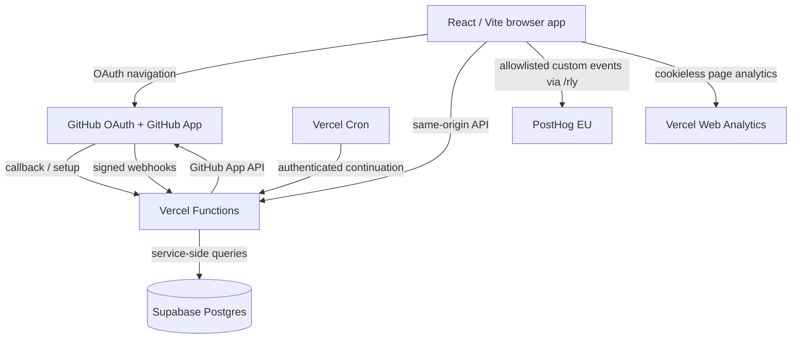

# Architecture

Dev Ledger is a GitHub-first analytics application with a deliberately narrow data model: ingest metadata required for metrics, normalize it server-side, and keep source code out of persistent storage.

## System overview

## Frontend

The client is React 19 + TypeScript, built with Vite and styled with Tailwind CSS.

The authenticated product has three top-level pages:

- **Overview** — measurement, work field, index, and longitudinal record.
- **Activity** — extremes, circadian pattern, rhythm, and activity history.
- **Code** — language composition, source growth, churn, and repository/project views.

A single live dashboard store normalizes the API response for all pages. Development fixtures are synthetic and are replaced by an inert stub in production builds.

## Authentication

GitHub OAuth establishes the user identity. GitHub App installations define which repositories Dev Ledger is allowed to read.

Sessions use a sealed HttpOnly cookie plus a server-side session record. Non-persistent sessions also carry a server-enforced inactivity lease renewed only through the heartbeat endpoint.

Browser-triggered mutations pass a same-origin guard before authentication or mutation logic.

## GitHub ingestion

Dev Ledger uses read-only GitHub App access.

The synchronization system:

1. discovers repositories available to the installation;
2. refreshes repository metadata and language byte counts;
3. ingests commit statistics and timestamps;
4. ingests minimal pull-request metadata;
5. tracks coverage so history can resume incrementally;
6. pauses safely on GitHub rate limits; and
7. continues via authenticated user sync, webhook activity, and scheduled cron work.

Webhook requests require a valid HMAC signature and use delivery IDs to prevent replayed business mutations.

## Data model

Supabase Postgres stores normalized records for users, installations, repositories, languages, commits, pull requests, coverage, sync state, sessions, and limited operational telemetry.

The application intentionally does not persist repository source code, commit messages, pull-request titles, commit or pull-request author identifiers (every stored row is already scoped to the signed-in user), raw provider exception text (sync errors persist closed taxonomy codes only), GitHub email addresses, OAuth tokens, installation tokens, or raw webhook payload bodies.

Application tables use row-level security and browser database roles have no direct table access. Server-side application queries use the backend credential and scope records to the authenticated internal user.

## Analytics

Two separate systems are used:

- **Vercel Web Analytics** for aggregate, cookieless traffic measurement.
- **PostHog EU** for an allowlisted set of custom product events.

PostHog autocapture, session replay, heatmaps, surveys, console capture, and performance capture are disabled. The application does not call `identify()`.

## Recovery

Schema is versioned in `migrations/`.

Backups are allowlist-scoped data-only dumps. Authentication sessions, security telemetry, webhook deduplication rows, and migration bookkeeping are intentionally excluded from restore archives.

CI runs a synthetic Postgres 17 recovery drill that applies migrations, seeds fixture data, creates a backup, restores it, and verifies security/data invariants.

See [disaster-recovery.md](disaster-recovery.md).
